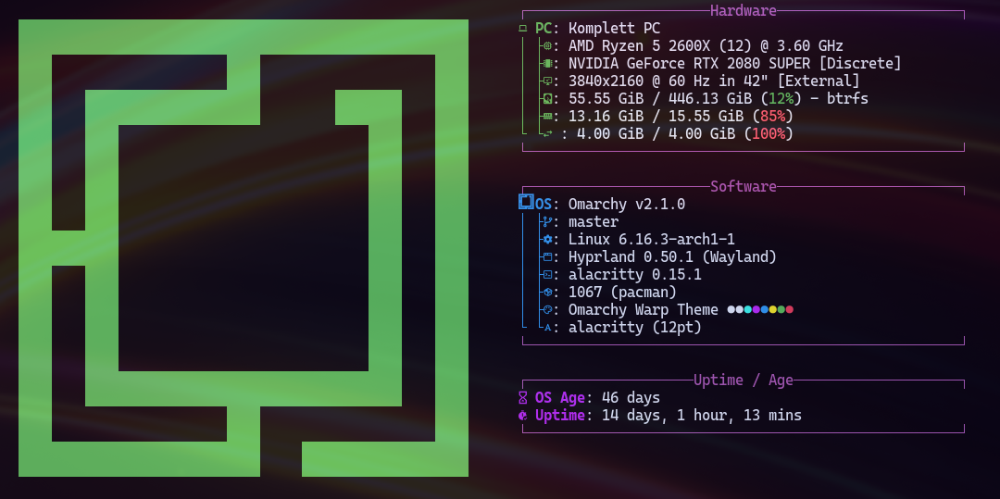

# Pulsar

Pulsar is a vibrant, cosmic-inspired dark theme for Omarchy that captures the brilliant energy of neutron stars and celestial phenomena. With electric blues, luminous magentas, and radiant cyans against the deep void of space, it's designed for those who code among the stars.

> In cosmic depths where pulsars spin,  
> Electric blues and magentas begin.  
> Each line of code, a stellar beam,  
> In pulsar's glow, where coders dream,  
> And brilliant focus lights within.  

## Screenshot

<p align="center">
  
</p>

<p align="center">
  
</p>

## Installation

### Omarchy

To install this theme, simply use the `omarchy-theme-install` command:

```bash
omarchy-theme-install https://github.com/bjarneo/omarchy-pulsar-theme
```

## X.com
[iamdothash](https://x.com/iamdothash)
